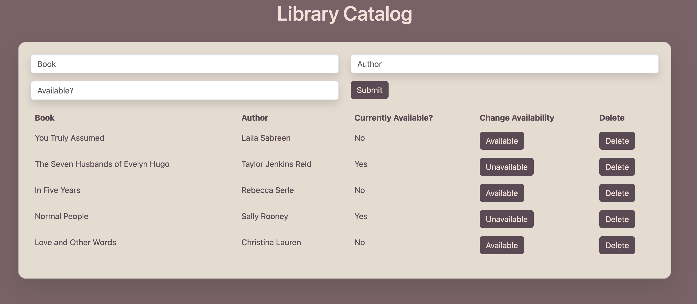

# Full Stack CRUD Library Catalog App:

## Description

_Duration: 4 hours_

Create afully functional CRUD app that allows library staff and administration to manage their catalogue of book!

To see the fully functional site, please visit: [DEPLOYED VERSION OF APP](www.heroku.com)

## Screen Shot

##### Tech Stack:

* Client-Side / Front-End:
  * HTML
  * CSS
  * JS
  * jQuery
* Server-Side / Back-End:
  * JS
  * [Node.js](https://nodejs.org/en/)
  * Express
  * Body Parser
  * [PostgreSQL](https://www.postgresql.org/download/)

## Installation

1. Clone this repository for your own access.
2. Open up your editor of choice and run an `npm install`
3. Using your preferred database manager - use the provided SQL file to set up the database that tracks your tasks and their status. 
4. Run `npm start` or `node server/server.js`in your terminal
5. Navigate to http://localhost:5000/

##### Usage:

This application can be utilized by library staff or admin to keep track of the books in their catalog and their availability status. As new books comes in, admin or staff are able to store the books in the catalog: 

1. Using the provided inputs to store information about the books (book title, author name, and current availabilty status)
2. Pressing the submit button adds the book to the catalog
3. Using the buttons provided to update books already in the catalog 
  - admin or staff can change availabilty status from `available` to `unavailable` as books are checked out and returned
  - delete books from the catalog to remove them from the rotation (if a book has been lost or destroyed)

## License
[MIT](https://choosealicense.com/licenses/mit/)

## Acknowledgement
Thanks to [Prime Digital Academy](www.primeacademy.io) who equipped and helped me to make this application a reality. (Thank your people!)
